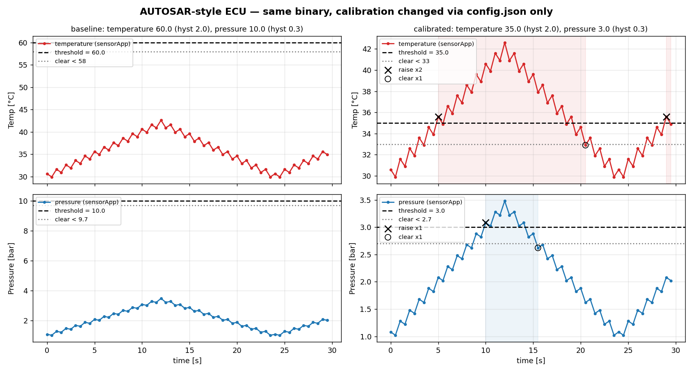
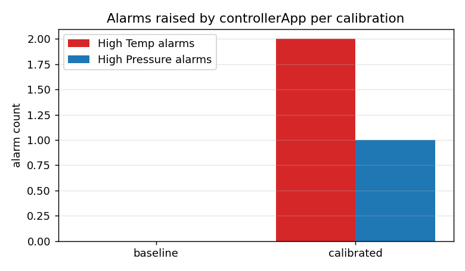

# Stage 4 demo — AUTOSAR-style ECU integration

Single entry point, < 2 min:

```bash
./demo/run_demo.sh            # 30 s per run (override with DURATION=10)
```

It will:

1. `make` → `build/ecu` (C++17, POSIX threads, nlohmann/json).
2. Run the ECU for 30 s with `demo/config/baseline.json` (thresholds 60 °C / 10 bar) — live log, no alarms.
3. Run the **same binary** for 30 s with `demo/config/calibrated.json` (35 °C / 3 bar, hysteresis 2 °C / 0.3 bar) — controller logs exactly one `[WARNING: High Temp!]` / `[WARNING: High Pressure!]` per crossing and one `[CLEARED: Temp]` / `[CLEARED: Pressure]` only once the value drops below `threshold − hysteresis`, despite ±0.6 °C / ±0.08 bar sensor noise.
4. Each run's `diagnostics/events.json` (DiagnosticEventService dump) is copied to `demo/out/events_<run>.json`.
5. `demo/plot_ecu.py` parses the stdout logs and writes `demo/out/ecu_telemetry.png`, `alarm_counts.png`, `summary.md`.
6. If `DD_API_KEY` (and optionally `DD_SITE`) is set, `demo/ship_datadog.py` posts the series as custom metrics `aptiv.ecu.*` (tags `run:baseline|calibrated`). Skipped silently otherwise.

## What is real vs. simulated

| Element | Status |
|---|---|
| Execution Manager, Service Registry, MessageQueue, sensor/controller SWCs | **Real C++ code, compiled and executed on the host** (Linux, g++) |
| Threshold / hysteresis calibration | Real: config schema v2 read and validated at start-up, no rebuild |
| Diagnostic event log | Real: `diagnosticApp` ring buffer, `diagnostics/events.json` written at shutdown |
| Sensor values | Host-simulated triangle wave with alternating noise (`sensor.rampSteps`, `tempNoise`, `pressureNoise`) standing in for the plant/HIL feed from Stages 1–3 |
| Datadog metrics | Real HTTP POST to `api.<DD_SITE>/api/v2/series` when the key is present |
| Target hardware | None — this stage is the platform-independent SWC layer; the same SWCs would be deployed on the ECU target in Stage 5/6 |

## Architecture

```mermaid
flowchart LR
    CFG[config.json<br/>calibration: thresholds, periods] --> EM

    subgraph ECU["build/ecu — Adaptive-AUTOSAR-style runtime (C++17)"]
        EM[Execution Manager<br/>runExecutionManager]
        EM -->|std::thread 1st| D[diagnosticApp SWC]
        EM -->|std::thread 2nd| S[sensorApp SWC]
        EM -->|std::thread 3rd| C[controllerApp SWC]
        EM -->|SIGINT → SHUTDOWN| LC[Lifecycle<br/>INIT / RUNNING / SHUTDOWN]

        S -->|registerService<br/>"SensorDataService"| SR[(Service Registry<br/>singleton)]
        C -->|discoverService| SR
        S -->|send SensorData| MQ[[MessageQueue&lt;SensorData&gt;]]
        MQ -->|receive| C
        D -->|registerService<br/>"DiagnosticEventService"| SR
        C -->|send DiagnosticEvent<br/>on raise/clear| DQ[[MessageQueue&lt;DiagnosticEvent&gt;]]
        DQ -->|ring buffer| D
    end

    D -->|at shutdown| EV[diagnostics/events.json]

    C -->|stdout / controller_log.txt<br/>WARNING flags| LOG[ECU log]
    LOG --> PY[demo/plot_ecu.py] --> PNG[ecu_telemetry.png]
    LOG --> DD[demo/ship_datadog.py] --> DDG[(Datadog<br/>aptiv.ecu.*)]
```

## Artifacts (`demo/out/`)




## Source changes made for the demo

- `controllerApp` runs two `HysteresisAlarm`s (temperature, pressure) configured via config schema v2 (see top-level `README.md`); v1 `warningThreshold` / `pressureWarningThreshold` still work as deprecated aliases.
- SWC log lines are composed in a `std::ostringstream` and written with a single `<<` so the two threads no longer interleave characters on stdout (needed for parsing).
- `Makefile`: `mkdir -p build`; `clean` removes `build/ecu` (was `build/ECU`).
