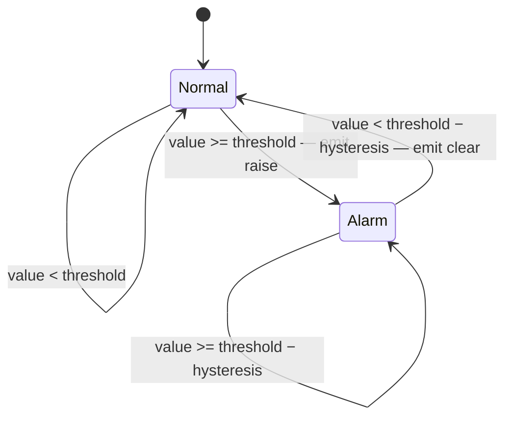
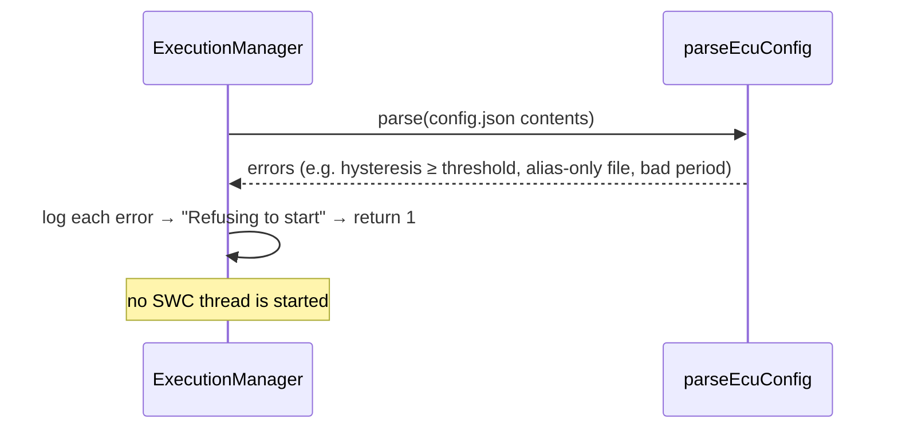

# Software Detailed Design — Baseline B2.0

| | |
|---|---|
| Change request | CR-2026-042 — Over-pressure protection, alarm hysteresis & diagnostic event logging |
| Design task | AE-9 (sub-tasks: AE-19/B-02, AE-20/B-01, AE-22/B-03 review gate) |
| Requirements | AE-8 — SWR-200…212 (parents: SYS-REQ-100…105) |
| Implementation | AE-10 — PR #18, branch `devin/1790863842-cr-2026-042-hysteresis-diagnostics` @ `f6731f2` |
| Downstream | AE-11 (unit tests), AE-12 (integration test) |
| Status | For review (design gate) |

## 0. Scope

Code-level design for the controller/diagnostics slice of CR-2026-042 so that implementation
(AE-10) is mechanical and tests (AE-11/AE-12) bind to stable interfaces.

- **B-01 (AE-20):** `HysteresisAlarm` state machine and per-channel wiring in `controllerApp` — §1.
- **B-02 (AE-19):** `DiagnosticEvent` type, `MessageQueue<DiagnosticEvent>` transport, bounded
  ring buffer + JSON dump, config schema v2 — §2, §3.
- **B-03 (AE-22):** `ExecutionManager` start-up/shutdown ordering, sequence diagrams,
  thread-safety, reconciliation with the AE-10 branch and the formal review record — §4–§7.

Out of scope: the implementation itself (AE-10), unit tests (AE-11), integration test (AE-12).
Inputs: A-02 ICD (event fields/serialisation), A-03 timing analysis (period-ordering rule).

Because AE-10 started before this gate closed, every interface below is stated as the **frozen
design**; where the AE-10 branch diverged from the original ticket sketch, the resolution is
recorded in §7.2.

---

## 1. `HysteresisAlarm` — controller alarm state machine (B-01)

### 1.1 Interface

`include/alarm_state.hpp` (C++17, no dependency on threads, queues or logging — pure unit):

```cpp
class HysteresisAlarm {
public:
    struct Config {
        float threshold;
        float hysteresis;
    };

    enum class State { Normal, Alarm };

    explicit HysteresisAlarm(Config config);

    // Returns true when this sample caused a state transition.
    bool update(float value);
    State state() const;
    const Config& config() const;

private:
    Config config_;
    State state_ = State::Normal;
};
```

`update()` returning `bool` ("a transition happened") replaces the earlier sketch of
`std::optional<Transition>`: the alarm stays free of `DiagnosticEvent` knowledge, and the
translation to an event is done once in `controllerApp` via `evaluateAlarm` (§1.4). The
`Transition` payload would have duplicated `state()` anyway.

### 1.2 State diagram



The dead band is the half-open interval `[threshold − hysteresis, threshold)`: inside it the
current state is held, so a noisy signal hovering just under the threshold produces no chatter
once cleared, and no re-raise while falling.

### 1.3 Truth table

`T` = `config.threshold`, `H` = `config.hysteresis`. Every `(state × input region)` cell is
defined; there is no "undefined" input.

| Current state | `v < T − H` | `T − H ≤ v < T` | `v ≥ T` | `v` = NaN |
|---|---|---|---|---|
| `Normal` | `Normal`, no event | `Normal`, no event | `Alarm`, **raise** | `Normal`, no event |
| `Alarm` | `Normal`, **clear** | `Alarm`, no event | `Alarm`, no event | `Alarm`, no event |

Rules and rationale:

- **Boundary equality is asymmetric on purpose:** `v == T` raises (≥), but clearing requires
  `v < T − H` strictly, so `v == T − H` holds the alarm. Both edges are covered by tests.
- **NaN / non-finite samples:** every comparison against NaN is false, so the alarm simply
  holds its state — a corrupt sample can neither raise nor clear an alarm. Config values are
  validated as finite at load (§3.4), so `T`/`H` can never be NaN at this point.
- **First sample already ≥ T:** the initial state is `Normal`, so the first sample raises
  immediately — no warm-up suppression.
- **Config change at runtime:** `Config` is immutable after construction. B2.0 has no
  recalibrate-at-runtime path; changing thresholds means restarting the ECU (or reconstructing
  the alarm, which resets to `Normal`). Decision D-1, reviewed in §7.

### 1.4 Wiring in `controllerApp`

`controllerApp` holds one `HysteresisAlarm` per channel (`temperature`, `pressure`) and feeds
every received `SensorData` sample through both, once, on arrival. Per sample it emits at most
one log flag and one `DiagnosticEvent` per channel — only on transitions (SWR-203).

`include/controller_swc.hpp`:

```cpp
// Feeds one sample into `alarm`; returns the DiagnosticEvent for a raise/clear transition.
std::optional<DiagnosticEvent> evaluateAlarm(HysteresisAlarm& alarm, Channel channel,
                                             float value,
                                             std::chrono::system_clock::time_point ts);

void controllerApp(ControllerConfig config);
```

`evaluateAlarm` is the single place where a `bool` transition becomes a `DiagnosticEvent`
(`kind` = `Raised` iff post-update state is `Alarm`). This signature differs from the ticket
sketch `controllerApp(const ControllerConfig&, MessageQueue<DiagnosticEvent>&)` — the queue is
discovered through `ServiceRegistry` instead (§4.1); see §7.2 row 1.

Log strings on transition (SWR-203 — one line each, `<Channel>` ∈ `Temp` | `Pressure`):

- raise: `[WARNING: High <Channel>!]`
- clear: `[CLEARED: High <Channel>]`

### 1.5 Edge cases handed to AE-11 (unit-test candidates)

TC-202x / TC-203x candidates:

1. `v == T` raises; `v == T − ε` does not.
2. `v == T − H` holds `Alarm`; `v == T − H − ε` clears.
3. Oscillation inside the dead band produces zero events.
4. First sample `> T` raises on the first `update`.
5. After clear, a value in `[T−H, T)` does not re-raise.
6. NaN input in both states → no transition, state held.
7. `update()` return value is `true` exactly on transitions, `false` otherwise.
8. `evaluateAlarm` produces `Raised`/`Cleared` events carrying `ts`, `channel`, `value`, `threshold`.

---

## 2. `DiagnosticEvent` and `diagnosticApp` (B-02)

### 2.1 Event type

`include/diagnostic_types.hpp`:

```cpp
enum class Channel { Temperature, Pressure };
enum class EventKind { Raised, Cleared };

struct DiagnosticEvent {
    std::chrono::system_clock::time_point ts;
    Channel channel;
    float value;
    float threshold;
    EventKind kind;
};
```

Plain value type — copied through `MessageQueue<DiagnosticEvent>`; no pointers, no ownership.

### 2.2 Serialisation (A-02 ICD mapping)

Serialisation is owned by the consumer: `diagnosticEventsToJson()` in the diagnostics SWC maps
each event to the A-02 wire/persist shape. There is deliberately no `to_json` member on
`DiagnosticEvent` — the event type is the internal contract, the JSON is the ICD (§7.2 row 3).

| `DiagnosticEvent` field | JSON key | Encoding |
|---|---|---|
| `ts` | `timestamp` | ISO-8601 UTC, millisecond precision, `Z` suffix |
| `channel` | `channel` | `"temperature"` \| `"pressure"` |
| `kind` | `kind` | `"raise"` \| `"clear"` |
| `kind` | `state` | `"ALARM"` \| `"NORMAL"` (post-transition state, derived) |
| `value` | `value` | number, rounded to 3 decimals |
| `threshold` | `threshold` | number, rounded to 3 decimals |
| — | `capacity` | top-level: configured ring-buffer capacity |
| — | `dropped` | top-level: events overwritten on overflow |
| — | `events` | top-level: array, oldest first |

### 2.3 `diagnosticApp` and the ring buffer

`include/diagnostic_swc.hpp`:

```cpp
struct DiagnosticConfig {
    std::size_t capacity = 256;                          // SWR-211 / A-02
    std::string outputFile = "diagnostics/events.json";  // SWR-212
};

// Fixed-capacity ring buffer; on overflow the oldest event is overwritten
// and counted in dropped(). Owned by the diagnosticApp thread only.
class DiagnosticEventBuffer {
public:
    explicit DiagnosticEventBuffer(std::size_t capacity);
    void push(const DiagnosticEvent& event);
    std::vector<DiagnosticEvent> events() const;  // oldest first
    std::size_t size() const;
    std::size_t capacity() const;
    std::size_t dropped() const;
};

std::string toIso8601(std::chrono::system_clock::time_point ts);
nlohmann::json diagnosticEventsToJson(const DiagnosticEventBuffer& buffer);
bool writeDiagnosticEvents(const DiagnosticEventBuffer& buffer, const std::string& path);

// Returns false if the shutdown dump could not be written.
bool diagnosticApp(MessageQueue<DiagnosticEvent>& queue, DiagnosticConfig config);
```

Lifecycle of `diagnosticApp`:

1. `diagnosticState = RUNNING` (CAS, §6), then `ServiceRegistry::registerService(
   "DiagnosticEventService", &queue)` — this is what unblocks the EM's ordering barrier (§4.1).
2. Blocking `queue.receive()` loop; every event is `push`ed into the buffer.
3. When the EM closes the queue the loop drains remaining events and exits; the buffer is
   dumped to `outputFile` (parent directories created as needed) and the return value reports
   write success, which becomes part of the process exit code (§4.3).

Overflow policy (SWR-211): `push` on a full buffer overwrites the **oldest** slot and
increments `dropped()`; `events()` returns survivors oldest-first. Capacity `0` is impossible —
rejected at config load (§3.4).

Note: `diagnosticApp` returns `bool`, not `void` as sketched — the dump result must reach the
process exit code (§7.2 row 4).

### 2.4 Example `diagnostics/events.json`

```json
{
  "capacity": 256,
  "dropped": 0,
  "events": [
    {
      "timestamp": "2026-10-01T14:22:10.341Z",
      "channel": "temperature",
      "kind": "raise",
      "state": "ALARM",
      "value": 35.0,
      "threshold": 35.0
    }
  ]
}
```

---

## 3. Config schema v2

Schema file: `config/schema_v2.json` (JSON Schema 2020-12). Parsing/validation entry point:
`ConfigParseResult parseEcuConfig(const nlohmann::json& root)` in `include/ecu_config.hpp`.
Every key is optional; absent keys fall back to the defaults below (SWR-200).

### 3.1 Keys and defaults

| Path | Type | Default | Constraint |
|---|---|---|---|
| `schemaVersion` | int | `1` | `1` or `2` |
| `sensor.startTemp` | number | `20.0` | finite |
| `sensor.tempStep` | number | `1.0` | finite |
| `sensor.startPressure` | number | `1.0` | finite |
| `sensor.pressureStep` | number | `0.1` | finite |
| `sensor.rampSteps` | int | `0` | `≥ 0`; `0` = monotonic ramp, `N` = triangle wave |
| `sensor.tempNoise` | number | `0.0` | alternating ± offset per sample |
| `sensor.pressureNoise` | number | `0.0` | alternating ± offset per sample |
| `sensor.periodMs` | int | `1000` | `> 0`, and `≤ controller.periodMs` (§3.4) |
| `controller.thresholds.temperature` | number | `35.0` | `≥ 0` |
| `controller.thresholds.pressure` | number | `3.0` | `≥ 0` |
| `controller.hysteresis.temperature` | number | `2.0` | `≥ 0`, `< threshold` |
| `controller.hysteresis.pressure` | number | `0.3` | `≥ 0`, `< threshold` |
| `controller.periodMs` | int | `1000` | `> 0` |
| `diagnostics.capacity` | int | `256` | `≥ 1` |
| `diagnostics.outputFile` | string | `diagnostics/events.json` | non-empty |

Config keys are named `capacity`/`outputFile` (not the `bufferSize`/`outputPath` sketched in
AE-19) — resolved in favour of the implemented names, §7.2 row 5.

### 3.2 v1 → v2 key mapping

Only the alarm thresholds move; everything else keeps its v1 path.

| v1 key | v2 key |
|---|---|
| `controller.warningThreshold` | `controller.thresholds.temperature` |
| `controller.pressureWarningThreshold` | `controller.thresholds.pressure` |
| `sensor.*`, `controller.periodMs` | unchanged |

### 3.3 Migration note

A v1 file keeps working unchanged: each deprecated alias is accepted and produces **one**
warning line, e.g. `controller.warningThreshold is deprecated; use
controller.thresholds.temperature`. If both the alias and the v2 key are present, the v2 key
wins and a warning is logged (`… ignored; controller.thresholds.temperature takes precedence`).
To migrate, rename the two flat keys under `controller.thresholds` and set
`"schemaVersion": 2`. `config.json`, `demo/config/baseline.json` and
`demo/config/calibrated.json` are migrated in AE-10.

### 3.4 Validation rules (SWR-201)

Evaluated by `parseEcuConfig` after per-key type/default handling; any error is logged by the
EM as `[Execution Manager] Config error: <text>` and the ECU refuses to start with exit code 1.

| Rule | Error text |
|---|---|
| negative threshold | `controller.thresholds.<channel> must be >= 0` |
| negative hysteresis | `controller.hysteresis.<channel> must be >= 0` |
| `hysteresis ≥ threshold` | `controller.hysteresis.<channel> must be < controller.thresholds.<channel>` |
| non-positive periods | `sensor.periodMs must be > 0` / `controller.periodMs must be > 0` |
| **sensor slower than controller** | `sensor.periodMs must be <= controller.periodMs` |
| `rampSteps < 0` | `sensor.rampSteps must be >= 0` |
| `capacity < 1` | `diagnostics.capacity must be >= 1` |
| empty `outputFile` | `diagnostics.outputFile must be a non-empty string` |
| bad `schemaVersion` | `schemaVersion must be 1 or 2` |
| non-finite / wrong-typed value | `<path> must be a finite number` / `must be a number` / `must be an integer` |

The `sensor.periodMs ≤ controller.periodMs` rule (A-03) is what makes the SWR-204 latency
bound expressible: a raise can only be observed when a crossing sample exists, so the producer
period must not exceed the bound the controller is required to meet. **Not yet implemented on
the AE-10 branch — rework item R-2 (§7.2).**

---

## 4. ExecutionManager ordering and lifecycle (B-03)

`int runExecutionManager(const std::string& configPath = "config.json")` — returns the process
exit code (was `void`; §7.2 row 8).

### 4.1 Start-up order

```
load config  ──error──▶  log errors, exit 1 (no thread started)
     │ ok
     ▼
diagnosticApp thread          (registers "DiagnosticEventService" queue)
discoverService("DiagnosticEventService")   ◀ ordering barrier in EM
sensorApp thread              (registers "SensorDataService" queue)
controllerApp thread          (discovers both queues)
```

`diagnosticApp` is **first up** because SWR-210 requires the service registered before the
controller can raise events. The EM blocks on `discoverService("DiagnosticEventService")` after
spawning the thread, so ordering does not rely on a race — `ServiceRegistry::discoverService`
waits on a condition variable until the name appears.

### 4.2 Shutdown order — reverse

```
SIGINT/SIGTERM ──▶ handleSignal(): sensorState = controllerState = SHUTDOWN   (atomics only)
sensorThread.join()          sensor exits at next loop iteration (≤ sensor.periodMs)
sensorQueue.close()          wakes controller's receiveFor
controllerThread.join()      controller exits (≤ controller.periodMs)
diagnosticQueue.close()      wakes diagnostic's receive; pending events stay readable
diagnosticThread.join()      drains queue, writes diagnostics/events.json LAST
return diagnosticsWritten ? 0 : 1
```

`diagnosticApp` is **last down** so the dump (SWR-212) sees every event the controller ever
sent. The signal handler deliberately does **not** touch `diagnosticState` — diagnostics shuts
down only when its queue is closed by the EM, which is what makes "drain before dump" reliable.

- **Shutdown timeout:** joins are bounded without a watchdog — each loop wakes within one
  `periodMs` (bounded `receiveFor`, signal-visible states) and the queue drain is finite.
  A genuinely stuck SWC would block shutdown; accepted for B2.0 (decision D-2), a bounded-join
  watchdog is a listed future hardening.
- **Undelivered events:** `MessageQueue::close()` keeps queued messages readable, so the
  drain loop cannot lose an event already sent. Sends after `close()` are dropped inside
  `send()` — after controller join nothing produces events, so this path is unreachable in
  the normal flow and safe if it ever occurred.

### 4.3 Exit codes

`0` = clean shutdown and dump written. `1` = config unreadable/invalid (before any SWC
started) or the diagnostics dump could not be written.

### 4.4 Lifecycle state

`AppState { INIT, RUNNING, SHUTDOWN }` per SWC, held in `std::atomic`s:
`sensorState`, `controllerState`, and new `diagnosticState`. SWCs move `INIT → RUNNING` via
`compare_exchange_strong`, so a `SHUTDOWN` requested during start-up (e.g. while the EM waits
on the service barrier) is never overwritten — a SWC that comes up already-shutdown exits at
its first loop check. `handleSignal` performs only lock-free atomic stores (async-signal-safe).

---

## 5. Sequence diagrams

### 5.1 Normal sample

```mermaid
sequenceDiagram
    participant S as sensorApp
    participant Q as MessageQueue&lt;SensorData&gt;
    participant C as controllerApp
    participant A as HysteresisAlarm
    S->>Q: send(SensorData{t, p})
    C->>Q: receiveFor(controller.periodMs)
    Q-->>C: SensorData
    C->>A: update(t) / update(p)
    A-->>C: false (no transition)
    C->>C: log "Temp = …, Pressure = …"
```

### 5.2 Threshold crossing (raise)

```mermaid
sequenceDiagram
    participant S as sensorApp
    participant Q as MessageQueue&lt;SensorData&gt;
    participant C as controllerApp
    participant A as HysteresisAlarm temp
    participant D as MessageQueue&lt;DiagnosticEvent&gt;
    participant G as diagnosticApp
    S->>Q: send(SensorData{t ≥ T, p})
    Q-->>C: SensorData
    C->>A: update(t)
    A-->>C: true (Normal → Alarm)
    C->>C: log "[WARNING: High Temp!]"
    C->>D: send(DiagnosticEvent{ts, Temperature, t, T, Raised})
    D-->>G: receive() → buffer.push(event)
```

### 5.3 Hysteresis clear

```mermaid
sequenceDiagram
    participant Q as MessageQueue&lt;SensorData&gt;
    participant C as controllerApp
    participant A as HysteresisAlarm temp in Alarm
    participant D as MessageQueue&lt;DiagnosticEvent&gt;
    participant G as diagnosticApp
    Q-->>C: SensorData{t: T−H ≤ t < T}
    C->>A: update(t)
    A-->>C: false — dead-band hold, no log line, no event
    Q-->>C: SensorData{t < T−H}
    C->>A: update(t)
    A-->>C: true (Alarm → Normal)
    C->>C: log "[CLEARED: High Temp]"
    C->>D: send(DiagnosticEvent{…, Cleared})
    D-->>G: receive() → buffer.push(event)
```

### 5.4 Shutdown dump

```mermaid
sequenceDiagram
    participant Sig as signal handler
    participant EM as ExecutionManager
    participant S as sensorApp
    participant C as controllerApp
    participant D as MessageQueue&lt;DiagnosticEvent&gt;
    participant G as diagnosticApp
    Sig->>Sig: sensorState = controllerState = SHUTDOWN
    EM->>S: join()
    EM->>C: close(sensorQueue) → join()
    EM->>D: close() — pending events stay readable
    D-->>G: drain remaining events
    EM->>G: join()
    G->>G: writeDiagnosticEvents(buffer → diagnostics/events.json)
    G-->>EM: bool written → exit code
```

### 5.5 Config-load failure



---

## 6. Thread-safety and error handling

- **Queue ownership.** Both `MessageQueue`s are created on `runExecutionManager`'s stack and
  outlive every thread (all threads join before it returns). `ServiceRegistry` stores plain
  pointers into that stack frame — safe because discovery resolves before threads are joined,
  never after.
- **Service endpoints.** `SensorDataService` is registered by its producer (`sensorApp`),
  `DiagnosticEventService` by its consumer (`diagnosticApp`) — the name denotes the *service*,
  i.e. the queue that service consumes.
- **No shared mutable state between SWCs.** Configs are passed **by value** (`SensorConfig`,
  `ControllerConfig`, `DiagnosticConfig`); `SensorData`/`DiagnosticEvent` are value types
  copied through queues; each `HysteresisAlarm` and the `DiagnosticEventBuffer` are confined to
  their owning thread and need no synchronisation.
- **Synchronisation points** are exactly: `MessageQueue` (mutex + condvar, `send`/`receive`/
  `receiveFor`/`close` callable from any thread), `ServiceRegistry` (mutex + condvar), and the
  lifecycle atomics. Nothing else is shared.
- **Logging from multiple threads.** Each SWC assembles a complete line in an
  `ostringstream` and writes it in one stream operation (plus `std::flush`), so concurrent
  `[Sensor]`/`[Controller]`/`[Diagnostics]` lines never interleave mid-line. File logs are
  per-SWC append-only files; the diagnostics artefact is a single write at shutdown.
- **Error handling.** Invalid config ⇒ refuse to start (exit 1) before any thread spawns;
  non-finite config values rejected at parse; NaN samples hold alarm state (§1.3); dump
  failure ⇒ `diagnosticApp` returns false ⇒ exit 1; sends on a closed queue are dropped by
  `MessageQueue`, never block.

---

## 7. Design review record (B-03)

- **Chair:** Software Team lead. **Reviewer:** Test Team lead. **Author:** Devin.
- **Package under review:** this document, `include/` stubs (§7.1), `config/schema_v2.json`
  (§3), PR `<link added in PR>`.
- **Verdict:** APPROVED pending closure of rework items R-1, R-2 on AE-10 — recorded here;
  formal sign-off happens on this PR / the AE-22 ticket.

### 7.1 Frozen interface list (input to AE-10, AE-11, AE-12)

```text
include/alarm_state.hpp      class HysteresisAlarm { Config{threshold,hysteresis},
                             enum State{Normal,Alarm}, update(float)->bool,
                             state(), config() }
include/diagnostic_types.hpp enum Channel{Temperature,Pressure}
                             enum EventKind{Raised,Cleared}
                             struct DiagnosticEvent{ts,channel,value,threshold,kind}
include/diagnostic_swc.hpp   struct DiagnosticConfig{capacity=256,
                               outputFile="diagnostics/events.json"}
                             class DiagnosticEventBuffer{push,events,size,capacity,dropped}
                             toIso8601, diagnosticEventsToJson, writeDiagnosticEvents
                             bool diagnosticApp(MessageQueue<DiagnosticEvent>&, DiagnosticConfig)
include/ecu_config.hpp       SensorConfig / ControllerConfig / EcuConfig / ConfigParseResult
                             ConfigParseResult parseEcuConfig(const nlohmann::json&)
include/controller_swc.hpp   evaluateAlarm(HysteresisAlarm&,Channel,float,time_point)
                               -> optional<DiagnosticEvent>
                             void controllerApp(ControllerConfig)
include/execution_manager.hpp int runExecutionManager(const std::string& = "config.json")
include/lifecycle.hpp        + std::atomic<AppState> diagnosticState
include/sensor_swc.hpp       SensorData sensorSample(const SensorConfig&, long long)
                             void sensorApp(MessageQueue<SensorData>&, SensorConfig)
```

### 7.2 Reconciliation with the AE-10 branch (`devin/1790863842-cr-2026-042-hysteresis-diagnostics` @ `f6731f2`)

Implementation began before this gate closed, so the branch's headers were diffed against the
B-01/B-02 sketches. Disposition: **accept** = design updated to match; **rework** = AE-10 must
change.

| # | Item | Sketch (AE-9/19/20) | AE-10 branch | Disposition |
|---|---|---|---|---|
| 1 | `controllerApp` signature | `(const ControllerConfig&, MessageQueue<DiagnosticEvent>&)` | `(ControllerConfig)`; queues via `ServiceRegistry` | **Accept** — discovery satisfies SWR-210's registration ordering and matches the `SensorDataService` pattern |
| 2 | `HysteresisAlarm::update` | `std::optional<Transition>` | `bool`; event built by `evaluateAlarm` | **Accept** — keeps the alarm free of event-type coupling; `evaluateAlarm` is the single transition→event point |
| 3 | event serialisation | `to_json` on `DiagnosticEvent` | `diagnosticEventsToJson(buffer)` in the diagnostics SWC | **Accept** — ICD mapping owned by the consumer; event stays a plain internal type |
| 4 | `diagnosticApp` return | `void` | `bool` (dump success → exit code) | **Accept** — required to surface dump failure |
| 5 | diagnostics config keys | `diagnostics.{bufferSize,outputPath}` | `diagnostics.{capacity,outputFile}` | **Accept** — design adopts implemented names (§3.1) |
| 6 | clear log text | `[CLEARED: High <Channel>]` | `[CLEARED: Temp]` / `[CLEARED: Pressure]` | **Rework R-1** — align to SWR-203 strings |
| 7 | `sensor.periodMs ≤ controller.periodMs` | required (§3.4) | not validated | **Rework R-2** — add the check + error text |
| 8 | `runExecutionManager` | `void()` | `int(configPath)` | **Accept** — exit code needed for config/dump failure |
| 9 | `sensorApp` signature | `(queue, startTemp, tempStep, periodMs)` | `(queue, SensorConfig)` + `sensorSample()` | **Accept** — config consolidation; enables ramp/noise calibration |
| 10 | lifecycle | two atomics | `+ diagnosticState`, CAS INIT→RUNNING | **Accept** — required for ordered shutdown and start-up race fix |

### 7.3 Findings and decisions

- **R-1** (AE-10): `transitionFlag` cleared-texts must read `[CLEARED: High Temp]` /
  `[CLEARED: High Pressure]` per SWR-203.
- **R-2** (AE-10): add `sensor.periodMs must be <= controller.periodMs` validation (§3.4).
- **D-1**: no runtime recalibration in B2.0 — `Config` immutable; restart to recalibrate.
- **D-2**: no shutdown watchdog in B2.0 — joins rely on bounded `receiveFor` waits + queue
  drain; bounded joins are future hardening.
- **D-3**: signal handler never stops `diagnosticApp` directly; the EM closes its queue after
  the controller joins, so the dump always runs last with all events retained.

---

## 8. Design-trace table (SWR → design element)

| SWR | Requirement (AE-8) | Design element | § |
|---|---|---|---|
| SWR-200 | read v2 config keys, documented defaults | `EcuConfig`/`ControllerConfig` defaults, `parseEcuConfig`, §3.1 table, `config/schema_v2.json` | §3 |
| SWR-201 | reject hysteresis ≥ threshold, negative/NaN; log + refuse start | `parseEcuConfig` validation rules + error texts; `runExecutionManager` exit 1 | §3.4, §4.1 |
| SWR-202 | two-state machine per channel, `≥ T` raise, `< T−H` clear | `HysteresisAlarm::update` + state diagram + truth table | §1 |
| SWR-203 | one log line + one `DiagnosticEvent` per transition | `evaluateAlarm`, `transitionFlag` strings, `DiagnosticEvent` | §1.4, §2 |
| SWR-204 | every sample evaluated; latency ≤ `controller.periodMs` | per-sample `evaluateAlarm` loop, bounded `receiveFor`, `sensor.periodMs ≤ controller.periodMs` rule | §1.4, §3.4 |
| SWR-210 | `DiagnosticEventService` registered before `controllerApp` starts | `diagnosticApp` registration + EM start-up barrier | §4.1 |
| SWR-211 | bounded ring buffer, drop-oldest + counter | `DiagnosticEventBuffer` | §2.3 |
| SWR-212 | shutdown dump to `diagnostics/events.json`, ISO-8601 | `diagnosticEventsToJson`, `writeDiagnosticEvents`, `toIso8601`, stop order | §2.2–2.4, §4.2 |

All SWR-200…212 map to a design element — no gaps.
